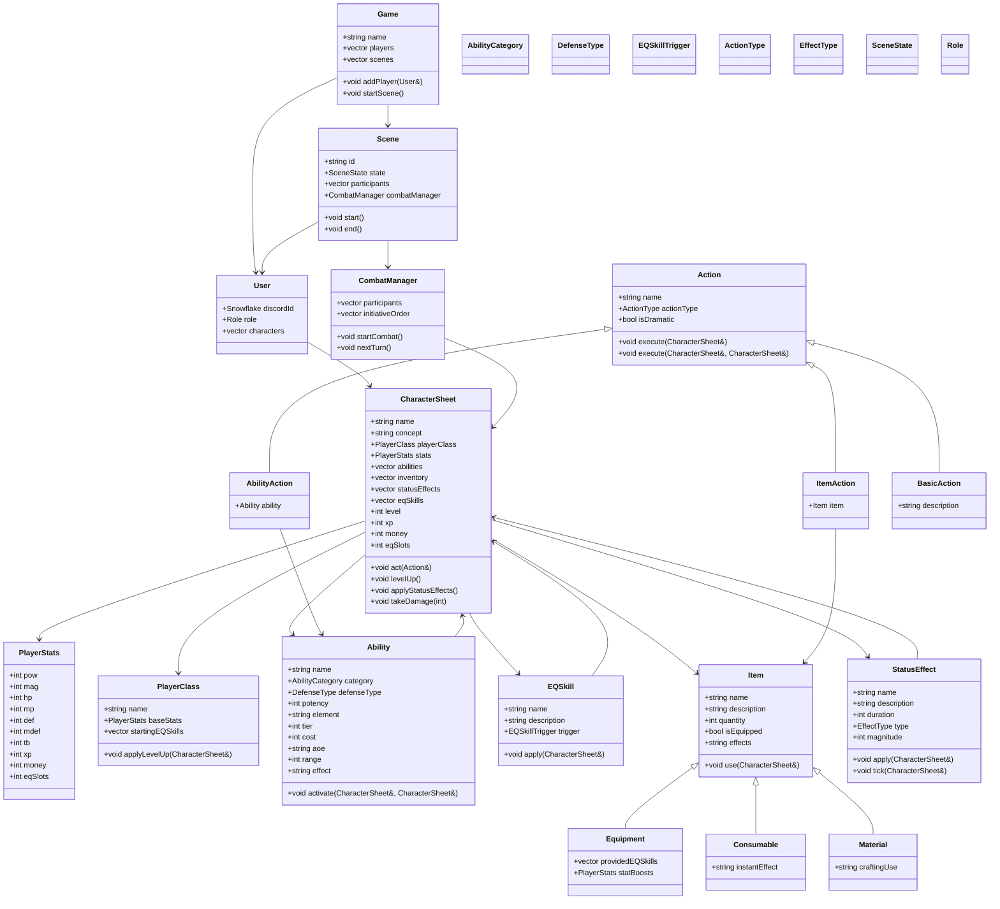

# Class Diagram

This diagram models the key game and bot classes for the Discord RPG system.

```mermaid
classDiagram
    class Game {
        +string name
        +vector<User> players
        +vector<Scene> scenes
        +void addPlayer(User&)
        +void startScene()
    }

    class CharacterSheet {
        +string name
        +string concept
        +PlayerClass playerClass
        +PlayerStats stats
        +vector<Ability> abilities
        +vector<Item> inventory
        +vector<StatusEffect> statusEffects
        +vector<EQSkill> eqSkills
        +int level
        +int xp
        +int money
        +int eqSlots
        +void act(Action&)
        +void levelUp()
        +void applyStatusEffects()
        +void takeDamage(int)
    }

    class PlayerStats {
        +int pow
        +int mag
        +int hp
        +int mp
        +int def
        +int mdef
        +int tb
        +int xp
        +int money
        +int eqSlots
    }

    class PlayerClass {
        +string name
        +PlayerStats baseStats
        +vector<EQSkill> startingEQSkills
        +void applyLevelUp(CharacterSheet&)
    }

    class Ability {
        +string name
        +AbilityCategory category
        +DefenseType defenseType
        +int potency
        +string element
        +int tier
        +int cost
        +string aoe
        +int range
        +string effect
        +void activate(CharacterSheet&, CharacterSheet&)
    }

    class EQSkill {
        +string name
        +string description
        +EQSkillTrigger trigger
        +void apply(CharacterSheet&)
    }

    class Action {
        +string name
        +ActionType actionType
        +bool isDramatic
        +void execute(CharacterSheet&)
        +void execute(CharacterSheet&, CharacterSheet&)
    }

    class AbilityAction {
        +Ability ability
    }

    class ItemAction {
        +Item item
    }

    class BasicAction {
        +string description
    }

    class Item {
        +string name
        +string description
        +int quantity
        +bool isEquipped
        +string effects
        +void use(CharacterSheet&)
    }

    class Equipment {
        +vector<EQSkill> providedEQSkills
        +PlayerStats statBoosts
    }

    class Consumable {
        +string instantEffect
    }

    class Material {
        +string craftingUse
    }

    class StatusEffect {
        +string name
        +string description
        +int duration
        +EffectType type
        +int magnitude
        +void apply(CharacterSheet&)
        +void tick(CharacterSheet&)
    }

    class CombatManager {
        +vector<CharacterSheet> participants
        +vector<CharacterSheet> initiativeOrder
        +void startCombat()
        +void nextTurn()
    }

    class Scene {
        +string id
        +SceneState state
        +vector<User*> participants
        +CombatManager combatManager
        +void start()
        +void end()
    }

    class User {
        +Snowflake discordId
        +Role role
        +vector<CharacterSheet> characters
    }

    class AbilityCategory {
    }
    class DefenseType {
    }
    class EQSkillTrigger {
    }
    class ActionType {
    }
    class EffectType {
    }
    class SceneState {
    }
    class Role {
    }

    Game --> User
    Game --> Scene
    Scene --> User
    User --> CharacterSheet
    CharacterSheet --> PlayerClass
    CharacterSheet --> PlayerStats
    CharacterSheet --> Ability
    CharacterSheet --> Item
    CharacterSheet --> StatusEffect
    CharacterSheet --> EQSkill
    Scene --> CombatManager
    CombatManager --> CharacterSheet
    Action <|-- AbilityAction
    Action <|-- ItemAction
    Action <|-- BasicAction
    Item <|-- Equipment
    Item <|-- Consumable
    Item <|-- Material
    AbilityAction --> Ability
    ItemAction --> Item
    Ability --> CharacterSheet
    EQSkill --> CharacterSheet
    StatusEffect --> CharacterSheet
```
